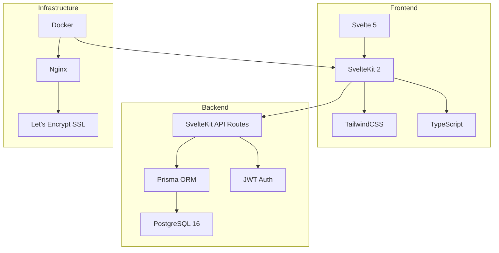
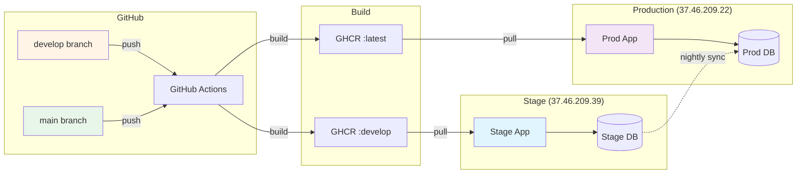
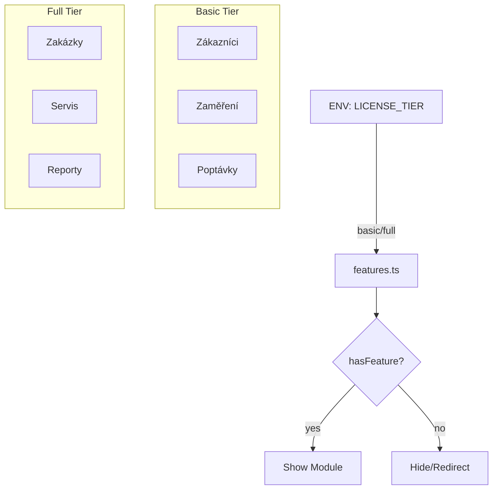
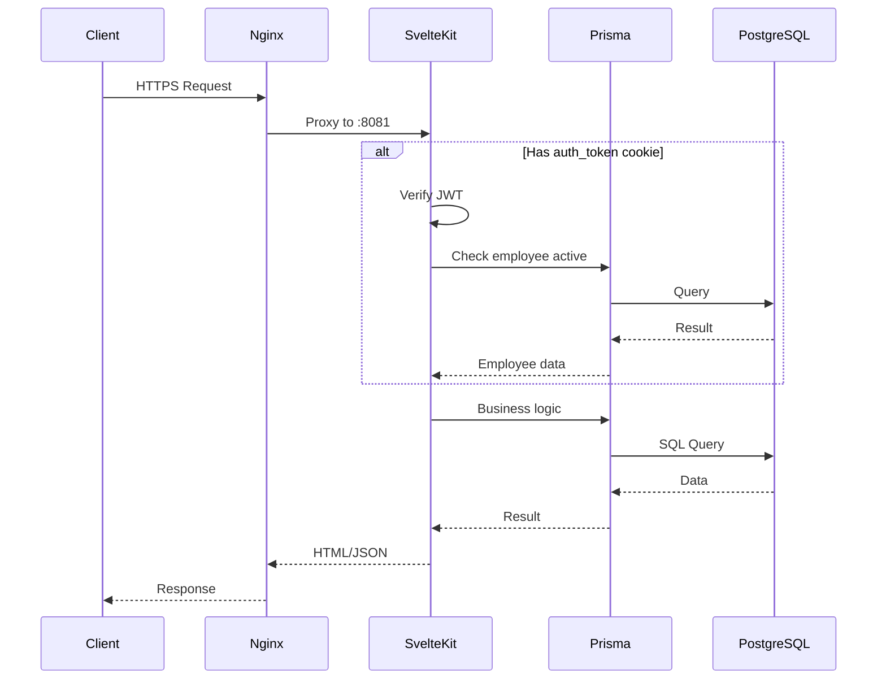
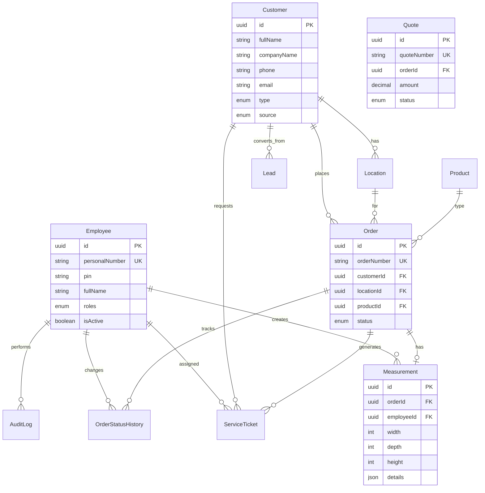
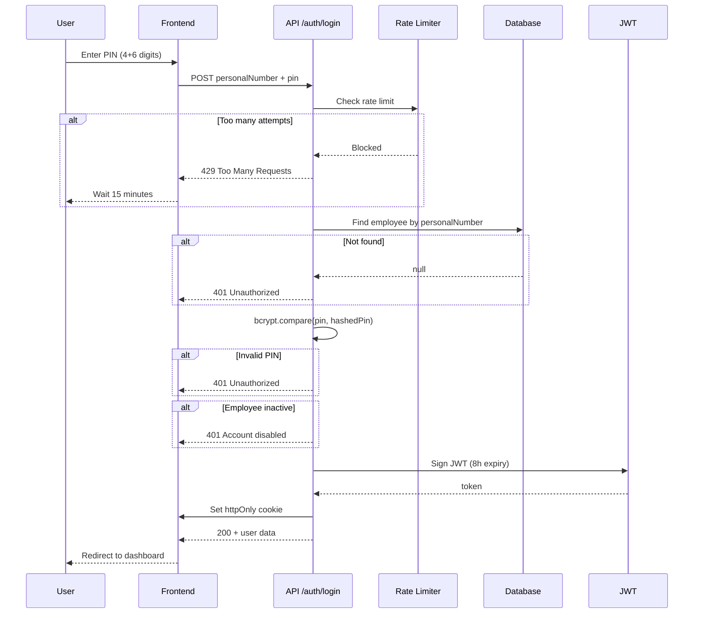
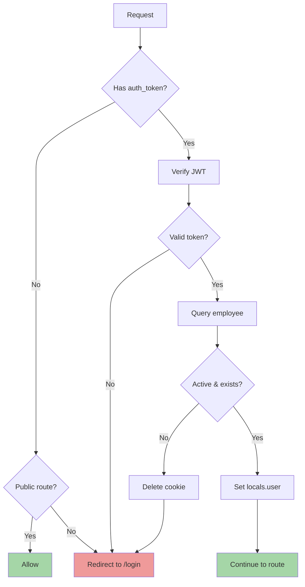
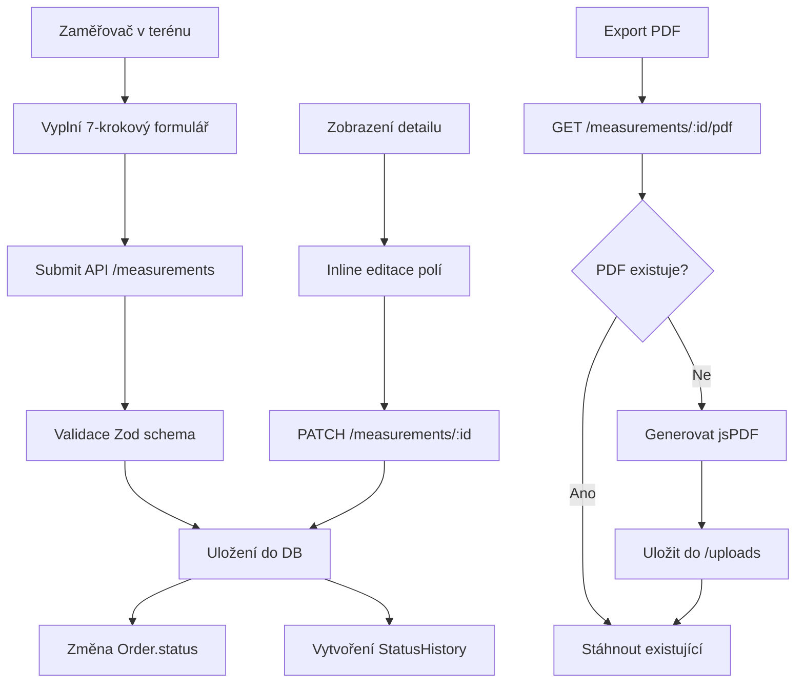

# Architecture Documentation

Architektura Futurol App - Centrální datová platforma pro správu zákazníků, zakázek a zaměření pergol.

> **Vlastník software:** Ascenta Lab | **Zákazník:** FARDAL s.r.o. (Futurol.cz)

---

## 📋 Obsah

- [High-Level Overview](#high-level-overview)
- [Tech Stack](#tech-stack)
- [System Architecture](#system-architecture)
- [Database Schema](#database-schema)
- [Authentication Flow](#authentication-flow)
- [Data Flow](#data-flow)
- [API Design](#api-design)
- [File Structure](#file-structure)

---

## High-Level Overview

Futurol App je full-stack TypeScript aplikace postavená na SvelteKit frameworku. Slouží jako centrální systém pro:

1. **Interní zaměstnance** (10 uživatelů) - správa zákazníků, zakázek, zaměření, servisů
2. **B2C zákazníky** - veřejný rádce výběru pergoly s lead capture

### Klíčové vlastnosti

- 📱 **Responzivní** - mobile-first design
- 🔐 **Bezpečné** - JWT auth, bcrypt, rate limiting
- 🚀 **Rychlé** - server-side rendering, optimalizované bundle
- 📊 **Data-driven** - PostgreSQL s Prisma ORM
- 🐳 **Containerized** - Docker deployment

---

## Tech Stack



### Dependency Matrix

| Layer | Technology | Version | Purpose |
|-------|-----------|---------|---------|
| **Framework** | SvelteKit | 2.x | Full-stack framework |
| **UI** | Svelte | 5.x | Reactive components |
| **Styling** | TailwindCSS | 3.4 | Utility-first CSS |
| **Language** | TypeScript | 5.x | Type safety |
| **ORM** | Prisma | 5.x | Database toolkit |
| **Database** | PostgreSQL | 16 | Relational DB |
| **Auth** | jsonwebtoken | 9.x | JWT tokens |
| **Hashing** | bcrypt | 6.x | Password hashing |
| **Icons** | lucide-svelte | 0.469 | Icon library |
| **PDF** | jsPDF + autotable | 4.x / 5.x | PDF generation |
| **Runtime** | Node.js | 20 LTS | Server runtime |
| **Container** | Docker | - | Containerization |
| **Web Server** | Nginx | - | Reverse proxy |

---

## System Architecture

### Deployment Architecture



### Environments

| Environment | URL | Branch | Server IP |
|-------------|-----|--------|-----------|
| Production | futurol.ascentalab.cz | `main` | 37.46.209.22 |
| Stage | stage.futurol.ascentalab.cz | `develop` | 37.46.209.39 |

### Feature Flags Architecture



### Original Architecture

```mermaid
graph LR
    A[Client Browser] -->|HTTPS| B[Nginx]
    B -->|Reverse Proxy| C[SvelteKit App<br/>Port 8081]
    C -->|Prisma| D[(PostgreSQL<br/>Port 5433)]
    B -->|SSL| E[Let's Encrypt]
    C -->|Upload| F[/uploads Volume]
    D -->|Persist| G[postgres_data Volume]
    
    style A fill:#e1f5ff
    style B fill:#fff4e6
    style C fill:#f3e5f5
    style D fill:#e8f5e9
```

### Request Flow



### Container Architecture

```
┌─────────────────────────────────────────┐
│  Docker Host (VPS)                      │
│                                         │
│  ┌────────────────────────────────┐    │
│  │  futurol-app Container         │    │
│  │                                 │    │
│  │  - Node.js 20                  │    │
│  │  - SvelteKit App               │    │
│  │  - Port 3000 -> 8081           │    │
│  │  - /app/uploads volume         │    │
│  └────────────────────────────────┘    │
│                                         │
│  ┌────────────────────────────────┐    │
│  │  futurol-db Container          │    │
│  │                                 │    │
│  │  - PostgreSQL 16               │    │
│  │  - Port 5432 -> 5433           │    │
│  │  - postgres_data volume        │    │
│  └────────────────────────────────┘    │
│                                         │
│  Network: futurol-app_default          │
└─────────────────────────────────────────┘
```

---

## Database Schema

### Entity Relationship Diagram



### Core Entities

#### Employee (Zaměstnanec)
```typescript
{
  id: uuid
  personalNumber: string (4 digits, unique)
  pin: string (hashed)
  fullName: string
  roles: Role[] (multi-role)
  isActive: boolean
  
  // Relations
  measurements: Measurement[]
  serviceTickets: ServiceTicket[]
  auditLogs: AuditLog[]
}

enum Role {
  admin, director, sales, 
  production_manager, surveyor, technician
}
```

#### Customer (Zákazník)
```typescript
{
  id: uuid
  fullName: string
  phone: string (required)
  email?: string
  company?: string
  source: CustomerSource (manual | advisor | import | web)
  
  // Relations
  locations: Location[]
  orders: Order[]
  leads: Lead[]
  serviceTickets: ServiceTicket[]
}
```

#### Order (Zakázka)
```typescript
{
  id: uuid
  orderNumber: string (FUT-YYYY-NNNN)
  customerId: uuid FK
  locationId: uuid FK
  productId?: uuid FK
  status: OrderStatus (9 stavů)
  priority: Priority
  deadlineAt?: datetime
  
  // Relations
  measurement?: Measurement
  quotes: Quote[]
  serviceTickets: ServiceTicket[]
  statusHistory: OrderStatusHistory[]
}

enum OrderStatus {
  lead →           // Nový lead
  customer →       // Kontaktovaný zákazník
  quote_sent →     // Odeslaná nabídka
  measurement →    // Naplánované zaměření
  contract →       // Podepsaná smlouva
  production →     // Ve výrobě
  installation →   // Montáž
  handover |       // Předáno zákazníkovi
  cancelled        // Zrušeno
}
```

#### Measurement (Zaměření)
```typescript
{
  id: uuid
  orderId: uuid FK (unique)
  employeeId: uuid FK
  measuredAt: datetime
  
  // Core measurements
  pergolaType: string
  width: int (mm)
  depth: int (mm)
  height: int (mm)
  clearanceHeight?: int (mm)
  
  // Flexible data
  details: json {
    roofPanels, legCount, legLength,
    colorFrame, colorRoof,
    wallType, insulation, anchoring,
    electrical, accessories, screens,
    installationNotes, additionalNotes
  }
  
  // Media
  photos: string[]
  pdfUrl?: string
  
  // Metadata
  gpsLat?, gpsLng?
  deviceInfo?: json
}
```

### Data Model Design Decisions

**Proč JSONB pro measurement.details?**
- ✅ Flexibilita - různé typy pergol mají různá pole
- ✅ Rychlá iterace - nové fieldy bez migrace
- ✅ Zachování struktury dat z formuláře
- ❌ Mínus: Nemůžeš indexovat vnořené pole

**Proč multi-role na Employee?**
- ✅ Realita - zaměstnanec může být zaměřovač + technik
- ✅ Jednoduší oprávnění - array.includes(role)
- ✅ Audit trail - vidíš všechny role v historii

**Proč soft delete?**
- ✅ Data retention - neztrácíme historii
- ✅ Audit - vidíme, co bylo smazáno
- ✅ Recovery - můžeme obnovit
- Implementováno přes `isActive` flag

---

## Authentication Flow

### Login Process



### Session Validation (hooks.server.ts)



### Authorization Levels

```typescript
// Public routes (no auth)
['/login', '/radce', '/api/auth/login', '/api/inquiries']

// Authenticated routes (any logged-in user)
['/dashboard', '/api/customers', '/api/orders']

// Role-based routes
{
  admin: ['ALL'],
  director: ['READ_ONLY'],
  sales: ['customers', 'orders', 'leads'],
  surveyor: ['measurements', 'service'],
  technician: ['service'],
  production_manager: ['orders:read', 'measurements:read']
}
```

---

## Data Flow

### B2C Rádce → Lead → Customer → Order


### Measurement Data Flow



---

## API Design

### RESTful Principles

```
Resource-based URLs:
  ✅ GET    /api/customers
  ✅ POST   /api/customers
  ✅ GET    /api/customers/:id
  ✅ PUT    /api/customers/:id
  ✅ DELETE /api/customers/:id

Nested resources:
  ✅ POST   /api/orders/:orderId/measurement
  ✅ GET    /api/customers/:id/orders

Action endpoints:
  ✅ PATCH  /api/service-tickets/:id/resolve
  ✅ POST   /api/auth/change-pin
```

### Response Format

**Success (200/201):**
```json
{
  "customer": { ... },
  "pagination": { ... }
}
```

**Error (4xx/5xx):**
```json
{
  "error": "Validation failed",
  "details": {
    "phone": "Invalid format"
  }
}
```

### Pagination Pattern

```typescript
// Query params
?page=1&limit=20&sortBy=createdAt&sortOrder=desc

// Response
{
  "items": [...],
  "pagination": {
    "page": 1,
    "limit": 20,
    "total": 156,
    "totalPages": 8
  }
}
```

---

## File Structure

```
futurol-app/
├── src/
│   ├── lib/
│   │   ├── components/          # Reusable Svelte components
│   │   │   ├── ui/             # Basic UI (Button, Input...)
│   │   │   └── features/       # Feature components (CustomerCard...)
│   │   ├── server/             # Server-only code
│   │   │   ├── auth.ts         # JWT + bcrypt utilities
│   │   │   ├── db.ts           # Prisma client singleton
│   │   │   └── rateLimit.ts    # Rate limiting
│   │   ├── stores/             # Svelte stores
│   │   │   └── user.ts         # User state
│   │   └── utils/              # Shared utilities
│   │       └── index.ts        # Helper functions
│   ├── routes/                 # SvelteKit file-based routing
│   │   ├── +layout.svelte      # Root layout
│   │   ├── +page.svelte        # Homepage
│   │   ├── api/                # API endpoints
│   │   │   ├── auth/
│   │   │   ├── customers/
│   │   │   ├── orders/
│   │   │   └── measurements/
│   │   ├── dashboard/          # Protected app
│   │   │   ├── +layout.server.ts  # Auth check
│   │   │   ├── customers/
│   │   │   ├── orders/
│   │   │   └── measurements/
│   │   ├── login/              # Login page
│   │   └── radce/              # Public advisor
│   ├── hooks.server.ts         # Request interceptor
│   ├── app.html                # HTML shell
│   └── app.css                 # Global styles
├── prisma/
│   ├── schema.prisma           # Database schema
│   ├── seed.ts                 # Seed data
│   └── migrations/             # DB migrations
├── static/                     # Static assets
│   ├── futurol-logo.svg
│   └── sky-background.webp
├── uploads/                    # User uploads
│   └── measurements/           # PDF exports
├── docker-compose.yml          # Container orchestration
├── Dockerfile                  # App container
├── futurol-nginx.conf         # Nginx config
└── deploy.sh                   # Deployment script
```

### Routing Convention

```
SvelteKit file-based routing:

/routes/dashboard/customers/+page.svelte
  → GET /dashboard/customers
  
/routes/api/customers/+server.ts
  → API /api/customers (GET, POST)
  
/routes/api/customers/[id]/+server.ts
  → API /api/customers/:id (GET, PUT, DELETE)
  
/routes/dashboard/+layout.server.ts
  → Server load function for all /dashboard/* routes
```

---

## Performance Considerations

### Frontend Optimization
- ✅ Server-side rendering (SSR)
- ✅ Code splitting per route
- ✅ WebP images (sky background)
- ✅ TailwindCSS tree-shaking
- ✅ Lazy component loading

### Backend Optimization
- ✅ Prisma query optimization (select only needed fields)
- ✅ Database indexing (unique constraints, FKs)
- ✅ Connection pooling (Prisma default)
- ✅ Rate limiting (prevent abuse)

### Database Optimization
```sql
-- Indexes (auto-created by Prisma)
CREATE UNIQUE INDEX employees_personalNumber_idx ON employees(personalNumber);
CREATE UNIQUE INDEX orders_orderNumber_idx ON orders(orderNumber);
CREATE INDEX orders_status_idx ON orders(status);
CREATE INDEX orders_customerId_idx ON orders(customerId);
```

---

## Security Architecture

### Defense in Depth

```
Layer 1: Network (Firewall, HTTPS only)
Layer 2: Application (Nginx reverse proxy)
Layer 3: Authentication (JWT + bcrypt + rate limiting)
Layer 4: Authorization (Role-based access control)
Layer 5: Data (Input validation, SQL injection prevention)
Layer 6: Audit (Logging all sensitive operations)
```

### Security Headers (Nginx)

```nginx
add_header X-Frame-Options "SAMEORIGIN";
add_header X-Content-Type-Options "nosniff";
add_header X-XSS-Protection "1; mode=block";
add_header Referrer-Policy "strict-origin-when-cross-origin";
```

---

**Naposledy aktualizováno:** 13. ledna 2026  
**Verze:** 1.0
